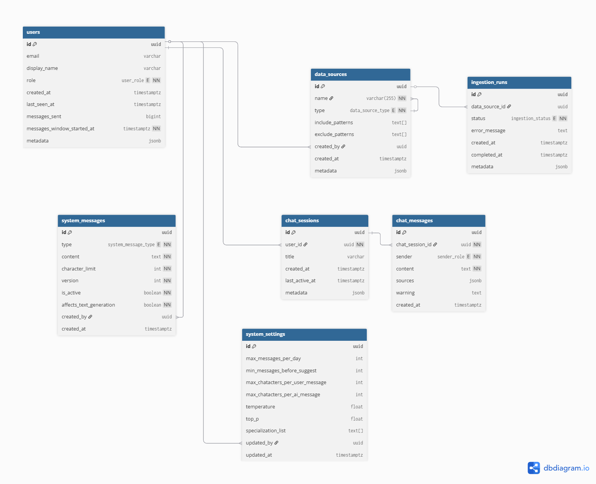

# Architecture Deep Dive

## Architecture

1. The user request is first sent through a security layer which comprises of AWS WAF, Amazon CloudFront, and AWS Shield for flagging any potential threats.

2. Users access the application through a React frontend hosted on AWS Amplify. AWS Cognito handles user authentication for admins, ensuring that only authorized administrators are able to access admin analytics and features. As for public users, there is no authentication in order to retain anonymity.

3. The frontend communicates with backend services via REST API (API Gateway → Lambda) for CRUD operations. Access is controlled using IAM roles and policies to ensure secure access to the services required to retain functionality. The WebSocket endpoint is used to stream live responses generated from the LLM to the user's frontend.

4. Application data is managed through AWS Lambda functions and stored in Amazon RDS through RDS Proxy, allowing the system to securely handle database requests while improving connection management and performance.

5. Amazon RDS acts as the main SQL database for the platform, storing the structured application data required to support the user experience.

6. The database contains LLM settings and prompts that guide it on how to respond to a user. It also contains the chat history needed for by LLM to continue the conversation.

7. The API also connects to a text generation Lambda function, which is responsible for preparing and sending user prompts into the generative AI workflow.

8. Amazon Bedrock processes the user query together with the retrieved context to generate a grounded response for the user based on the ingested knowledge base content.

9. Appointed administrators are able to upload files into Amazon S3 using pre-signed URLs, or provide website sources for ingestion into the knowledge base.

10. The content within the files and websites are stored as embeddings in Amazon OpenSearch Serverless. The system uses Retrieval-Augmented Generation (RAG) by searching the stored content for the most relevant context before generating a response.

AWS CodePipeline and AWS CodeBuild are used to create the Bedrock Knowledge Base and OpenSearch Serverless collection.

### Database Schema

### RDS PostgreSQL Tables

### Core Tables

#### `users` table

| Column Name                  | Description                                                |
| --------------------------- | ---------------------------------------------------------- |
| `id`                        | UUID, primary key                                          |
| `email`                     | Unique email of the user                                   |
| `display_name`              | Display name of the user                                   |
| `role`                      | User role (`student`, `admin`)                             |
| `created_at`                | Timestamp of account creation                              |
| `last_seen_at`              | Timestamp of the user's last activity                      |
| `messages_sent`             | Total number of messages sent by the user                  |
| `messages_window_started_at`| Timestamp marking the start of the current message window  |
| `metadata`                  | JSONB metadata for additional user information             |

#### `data_sources` table

| Column Name        | Description                                              |
| ------------------ | -------------------------------------------------------- |
| `id`               | UUID, primary key                                        |
| `name`             | Name of the data source                                  |
| `type`             | Data source type (`website`, `csv`, `json`)              |
| `include_patterns` | List of patterns to include during ingestion             |
| `exclude_patterns` | List of patterns to exclude during ingestion             |
| `created_by`       | Foreign key to users table                               |
| `created_at`       | Timestamp of creation                                    |
| `metadata`         | JSONB metadata for additional data source information    |

#### `ingestion_runs` table

| Column Name      | Description                                                 |
| ---------------- | ----------------------------------------------------------- |
| `id`             | UUID, primary key                                           |
| `data_source_id` | Foreign key to data_sources table                           |
| `status`         | Ingestion status (`running`, `failed`, `completed`)         |
| `error_message`  | Error message if ingestion fails                            |
| `created_at`     | Timestamp when the ingestion run was created                |
| `completed_at`   | Timestamp when the ingestion run completed                  |
| `metadata`       | JSONB metadata for additional ingestion run information     |

### Chat & Interaction Tables

#### `chat_sessions` table

| Column Name      | Description                        |
| ---------------- | ---------------------------------- |
| `id`             | UUID, primary key                  |
| `user_id`        | Foreign key to users table         |
| `title`          | Title of the chat session          |
| `created_at`     | Timestamp of creation              |
| `last_active_at` | Timestamp of last activity         |
| `metadata`       | JSONB metadata for session details |

#### `chat_messages` table

| Column Name       | Description                                              |
| ----------------- | -------------------------------------------------------- |
| `id`              | UUID, primary key                                        |
| `chat_session_id` | Foreign key to chat_sessions table                       |
| `sender`          | Sender role (`user`, `AI`)                               |
| `content`         | Message content                                          |
| `sources`         | JSONB list of sources used to generate the response      |
| `warning`         | Warning message attached to the response if applicable   |
| `created_at`      | Timestamp of message creation                            |

### System Configuration Tables

#### `system_messages` table

| Column Name                  | Description                                                                |
| ---------------------------- | -------------------------------------------------------------------------- |
| `id`                         | UUID, primary key                                                          |
| `type`                       | System message type used in the application prompt flow                    |
| `content`                    | Content of the system message                                              |
| `character_limit`            | Maximum allowed character count for the message                            |
| `version`                    | Version number of the system message                                       |
| `is_active`                  | Whether this version is currently active                                   |
| `affects_text_generation`    | Whether this message affects LLM response generation                       |
| `created_by`                 | Foreign key to users table                                                 |
| `created_at`                 | Timestamp of creation                                                      |

#### `system_settings` table

| Column Name                     | Description                                                        |
| ------------------------------- | ------------------------------------------------------------------ |
| `id`                            | UUID, primary key                                                  |
| `max_messages_per_day`          | Maximum number of messages a user can send per day                 |
| `min_messages_before_suggest`   | Minimum number of messages before suggestions are shown            |
| `max_chatacters_per_user_message` | Maximum number of characters allowed in a user message           |
| `max_chatacters_per_ai_message` | Maximum number of characters allowed in an AI message              |
| `temperature`                   | Temperature setting used for text generation                       |
| `top_p`                         | Top-p setting used for text generation                             |
| `specialization_list`           | List of supported specialization areas                             |
| `updated_by`                    | Foreign key to users table                                         |
| `updated_at`                    | Timestamp of last update                                           |

### Enums

#### `user_role`

Defines the type of user in the system:

- `student`
- `admin`

#### `sender_role`

Defines who sent a chat message:

- `user`
- `AI`

#### `data_source_type`

Defines the type of managed data source:

- `website`
- `csv`
- `json`

#### `ingestion_status`

Defines the status of an ingestion run:

- `pending`
- `queued`
- `running`
- `failed`
- `completed`

#### `system_message_type`

Defines the role of a system message in the text generation pipeline:

- `disclaimer`
- `guardrails`
- `system_role`
- `system_checklist`
- `system_instructions`
- `initial_prompt`
- `detective_phase_prompt`
- `suggestion_phase_prompt`
- `welcome_message`
- `partial_hallucination_warning`
- `full_hallucination_warning`