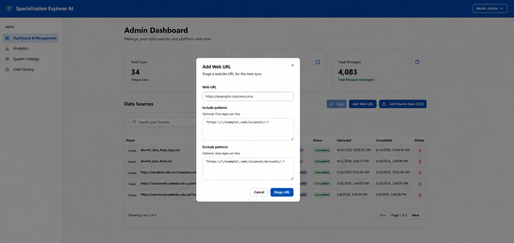
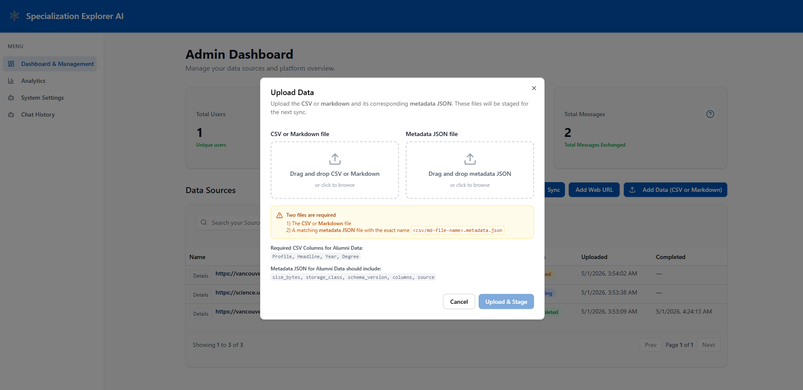
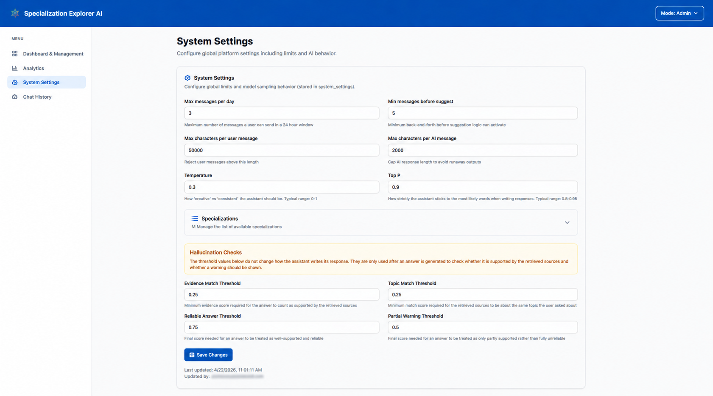
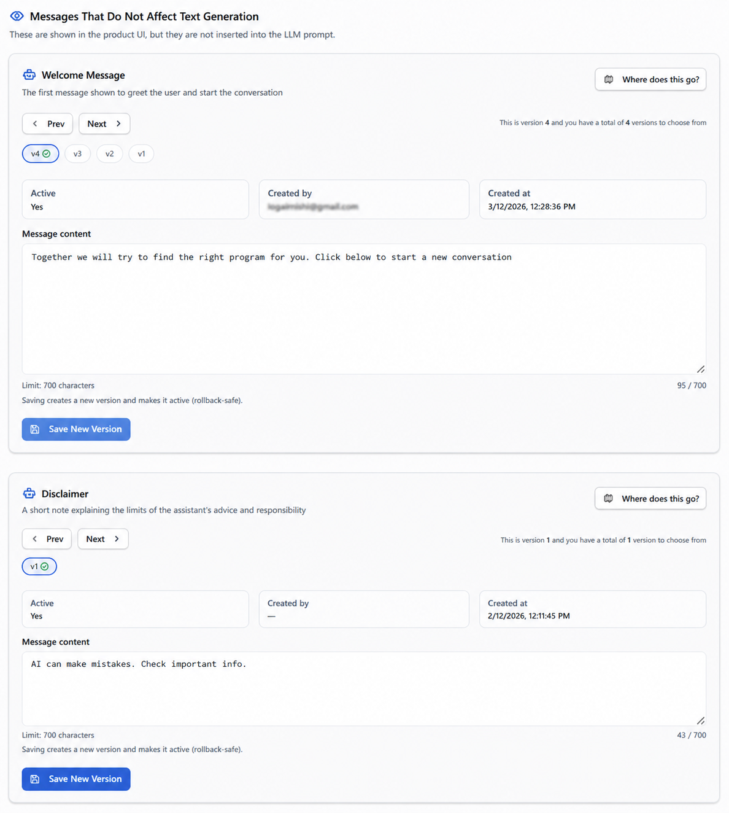

# User Guide

**Please ensure the application is deployed, instructions in the deployment guide here:**

- [Deployment Guide](./DEPLOYMENT_GUIDE.md)

Once you have deployed the solution, the following user guide will help you navigate the functions available.

| Index | Description |
| ----- | ----------- |
| [Getting Started](#getting-started) | Open the app and start a conversation |
| [Student View](#student-view) | Chat with the UBC Specialization Explorer to learn about UBC Science specializations |
| [Administrator View](#administrator-view) | Manage data sources, LLM settings, analytics, and chat history |

---

## Getting Started

Open the hosted Amplify URL provided during deployment, or run the frontend locally. No account is required — the chat interface is publicly accessible.

---

## Student View

The student-facing interface is a chat assistant that helps users explore UBC Faculty of Science specializations.

### Home Page

Users are immediately greeted with a welcome message and prompted to start a new conversation.

### Anonymous Pop-up

If the user has not signed in, a pop-up may appear explaining the anonymous session behaviour.

### Chat Interface

Each new chat starts with the assistant greeting the user and asking a series of questions to learn about their interests, study preferences, and goals. Once it has enough to go on, it switches to making recommendations.

### Specialization Details

After a recommendation is made, users can ask follow-up questions. The assistant can provide specialization course requirements, averages, and other program details sourced from the knowledge base.

### Hallucination Warnings

If the AI's response is partially or fully unsupported by the knowledge base, a warning banner appears below the message advising the user to verify the information against the UBC calendar.

### Expanded Sources

AI responses may include source references. Users can expand these to see the original documents or web pages the answer was drawn from.

### Chat Sessions

The left sidebar lists all previous chat sessions. Users can start a new chat with the `+` button, switch between sessions, or delete sessions via the actions menu on each session item.

---

## Administrator View

Administrators log in via Cognito and access the admin dashboard from the header. The sidebar provides navigation between four sections: Dashboard, System Settings, Analytics, and Chat History.

If the administrator has just been given access, they will not have the mode dragdown option on the top right. They will manually have to add `/admin/login` to the end of the URL to login for the first time. After this, they will be able to see the mode dragdown option and will seamlessly be able to switch between the student and administrator view.

### Dashboard

The dashboard shows platform-wide metrics (total users, chat sessions, and messages) and manages the knowledge base data sources.

#### Adding a Website

Click "Add Web URL" to stage a website for ingestion. Optionally provide include/exclude URL regex patterns to control which pages are crawled.

#### Adding a File

Click "Add Alumni Data (CSV or Markdown)" to upload a CSV/Markdown file and its corresponding metadata JSON. Both files are uploaded to S3 and staged for the next sync.

#### Syncing Data Sources

Once data sources are staged, click "Sync" to kick off an ingestion job. The table shows each source's type, name, and latest ingestion run status (Pending, Queued, Running, Completed, or Failed).

### Analytics

The Analytics page shows time-series charts for users, chat sessions, and questions asked. Use the "Last N Days" input to adjust the date range (1–365 days).

### System Settings

The System Settings page controls global platform behaviour and AI prompt configuration.

#### General Settings

Admins can configure:
- Max messages per day per user — daily cap on how many messages a student can send before being rate-limited.
- Min exchanges before suggestion phase activates — how many back-and-forth turns must happen before the AI is allowed to recommend specializations.
- Max characters per user and AI message — caps the length of both student inputs and AI responses.
- Temperature — controls how "creative" the AI sounds (0.0–1.0). Lower values produce more consistent, predictable answers; higher values produce more varied responses.
- Top-p — works alongside temperature to fine-tune response variety (0.0–1.0). In most cases the default value works well and doesn't need to be changed.
- Support score threshold — minimum score (0.0–1.0) for the AI's claims to be considered backed by the retrieved sources. Responses falling below this are immediately flagged as unsupported.
- Scope alignment score threshold — minimum score (0.0–1.0) for the retrieved sources to be considered relevant to the user's question. Falling below this also forces an unsupported label.
- Grounded threshold — score (0.0–1.0) above which a response is considered fully grounded and no warning is shown.
- Partially grounded threshold — score above which (but below the grounded threshold) a partial hallucination warning is shown. Responses below this receive a full warning.
- Allowed specializations list — the explicit list of specializations the AI is permitted to recommend.

#### System Messages — Affects Text Generation

These messages are injected into the AI prompt and directly influence how the assistant responds. Each message type has version history — admins can save new versions, activate a previous version, or delete inactive versions.

Message types that affect text generation:

- Initial Prompt — the opening message sent to the AI to kick off each conversation, setting the tone and first questions asked.
- System Role — defines who the assistant is and what it specializes in (e.g. UBC Science Specialization Explorer).
- Detective Phase Prompt — instructs the AI on how to gather missing information from the user before making any recommendations.
- Suggestion Phase Prompt — instructs the AI on how to transition into making specialization recommendations once enough context is collected.
- System Checklist — the list of key data points (subject area, career goal, work style, etc.) the AI must collect before suggesting a specialization.
- System Instructions — formatting and behavioral rules for how the AI structures and delivers its responses.
- Guardrails — hard boundaries that keep the AI on-topic, prevent jailbreaks, and block harmful or out-of-scope content.

#### System Messages — UI Only

These messages appear in the interface but are not sent to the AI model. They include the Welcome Message, Disclaimer, and hallucination warning text.

#### Message Versioning

Each system message supports full version history. Admins can navigate between versions using Prev/Next or the version chips, activate an older version, or delete unused versions.

#### Prompt Stack Viewer

The "How the Prompt Is Built" card shows a visual breakdown of how the active message blocks are assembled into the final AI prompt, with a toggle to preview the Detective vs. Suggestion phase layout.

### Chat History

The Chat History page lets admins review all user conversations. Expand a user row to see their sessions, then click a session to view the full message transcript on the right, including any sources the AI cited.

---

## Additional Resources

- [Deployment Guide](./DEPLOYMENT_GUIDE.md)
- [Architecture Documentation](./ARCHITECTURE_DEEP_DIVE.md)
- [API Documentation](./API_DOCUMENTATION.md)
